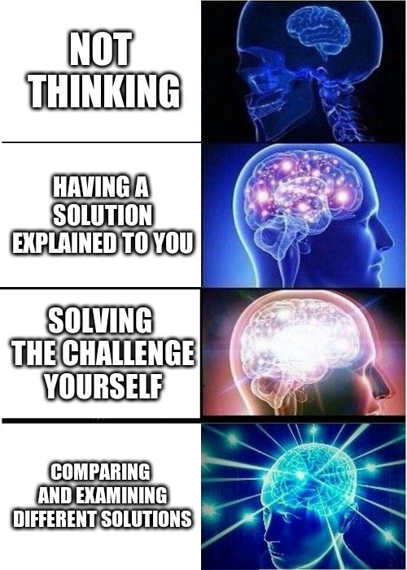
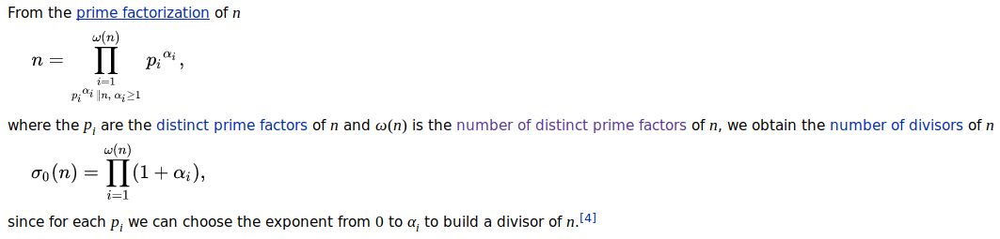

# Testing *Go*

## Testing *Go* with Project Euler.  
This is a repository to keep my code for solving project Euler challenges. It is not supposed to be an answer book (as if it could be). You can see the fantastic website and challenges [here](https://projecteuler.net/ "Project Euler").

---

## Why *Go*?
I chose Go because it is an exciting 'new' language I wanted to learn. Where speed is concerned, a compiled language is a must and C is often used because it is also operates at a very low level. Go is 'C-like' (Not derived from) so enjoys many of these benifits. I am willing to trade off a possible slight performance boost by using Go instead of C, which would be less fun and a lot harder not to mention I would loose the abilities of Go. Go is compiled down to assembly level code, executed directly on the processor and its garbage collector is fast and latency free. As if that wasn't enough, the speed factor is almost certainly outweighed by the concurrency available in Go to utilise multicore processing. Go is really fun with simplicity built-in. It has lots more features than what is listed here but they are left to the reader to discover once they try Go if they have not already.

---

## Why is this here?  
1. I would like to learn *Go* and solve these challenges. This is my record.
2.

**Solve the challenges youself first.** If however, after you have solved a challenge, you would like to compare or analyse a solution then please feel free to comment on the revelant issue if you would like and make suggestions. There are forums on the website itself as well which is a good place for discussion though it seems mostly people just posting their code. This repository is more _Go_ specific. 

---

Library details.

numbertheory:

primeNumbersBelowCeiling:  
This program creates a slice of all the numbers from 2 to the max prime size 'ceiling'. It uses a Euclidean sieve/Sieve of Eratosthenes to then find all the primes in the slice.

primeNumbersContinuously:  
This uses again an Euclidean sieve/Sieve of Eratosthenes but in parts. The program takes one small slice, the size of which is defined by the user and finds all the primes in that slice before moving on to a new slice. For each new slice it must check all the new numbers against the current prime numbers before sieving.

primeFactorisation:  
This program provides the prime factorisation of a number. It simply checks whether each prime number in order is a factor and if so, how many times, before moving on to the next prime.

lowestCommonMultiple:  
Returns the lowest common multiple of a group of numbers. lcm by raising each prime factor to the maximum number of times that prime factor appears in any of the numbers and then multiplying each of these results.

divisors:  
 - Function to return the number of divisors a number has using its prime factorisation.  

 - Functions to get all the divisors of a number.
 - Brute force functions to get all the divisors of a number.

digitsOfNumber:
 - Functions to fill a channel with the digits of both normal integers and big.Ints. 
 - Functions to return a slice of all the digits of both normal integers and big.Ints.
 - Functions to return the number of digits an integer and big.Int has.

maximumPathSumOfPyramid:
Two functions to calclulate the maximum sum of every path from top to bottom of a pyramid while
moving only to adjacent numbers on the row below.

nthPrimeNumber:
Returns the prime number at position n. For instance, the 7th prime number is 17.
